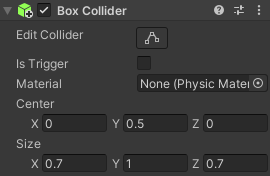

A collider is a shape that is used to detect when a GameObject collides, or intersects, with another GameObject. It’s much quicker for a computer to check for collisions with a simple collider shape than the complex shape of a GameObject.

A 'Box Collider' has a simple cube shape that can be sized and positioned to stop GameObjects occupying the same space. 

To add a Box Collider, go to 'Add Component' in the Inspector window for your GameObject and select 'Box Collider'. 

Change the values in the 'Center' and 'Size' properties until you are happy that they are above the ground and cover the whole of your GameObject. 

**Tip:** Box Colliders will need to be added to all GameObjects that you want to avoid occupying the same space.
