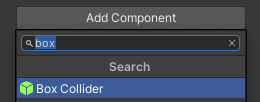
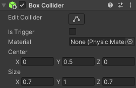

Un collider est une forme utilisée pour détecter la collision ou l'intersection d'un GameObject avec un autre GameObject. Il est beaucoup plus rapide pour un ordinateur de vérifier les collisions avec une forme de collision simple qu'avec la forme complexe d'un GameObject.

Un Box Collider a la forme d'un simple cube qui peut être dimensionné et positionné pour empêcher les GameObjects d'occuper le même espace.

Pour ajouter un Box Collider, va sur **Add Component** dans la fenêtre Inspector de ton GameObject et sélectionne **Box Collider**.

Modifie les valeurs des propriétés « Center » et « Size » jusqu'à ce que tu sois satisfait qu'elles soient au-dessus du sol et qu'elles recouvrent l'ensemble de ton GameObject.

**Astuce :** les Box Colliders devront être ajoutés à tous les GameObjects dont tu veux éviter qu'ils n'occupent le même espace.
