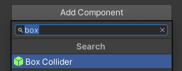

Een collider is een vorm die wordt gebruikt om te detecteren wanneer een GameObject botst of een ander GameObject kruist. Het is veel gemakkelijker voor een computer om te controleren op botsingen met een simpele vorm dan op de complexe vorm van een GameObject.

Een Box Collider heeft een eenvoudige kubusvorm die kan worden aangepast en gepositioneerd om te voorkomen dat GameObjects dezelfde ruimte innemen.

Om een Box Collider toe te voegen, ga je naar **Add Component** in het Inspector-venster voor je GameObject en selecteer je **Box Collider**.

Verander de waarden in de 'Center' en 'Size' eigenschappen totdat je tevreden bent dat ze boven de grond staan en het hele GameObject bedekken.

**Tip:** Box Colliders moeten worden toegevoegd aan alle GameObjects waarvan je wilt voorkomen dat ze dezelfde ruimte innemen.
